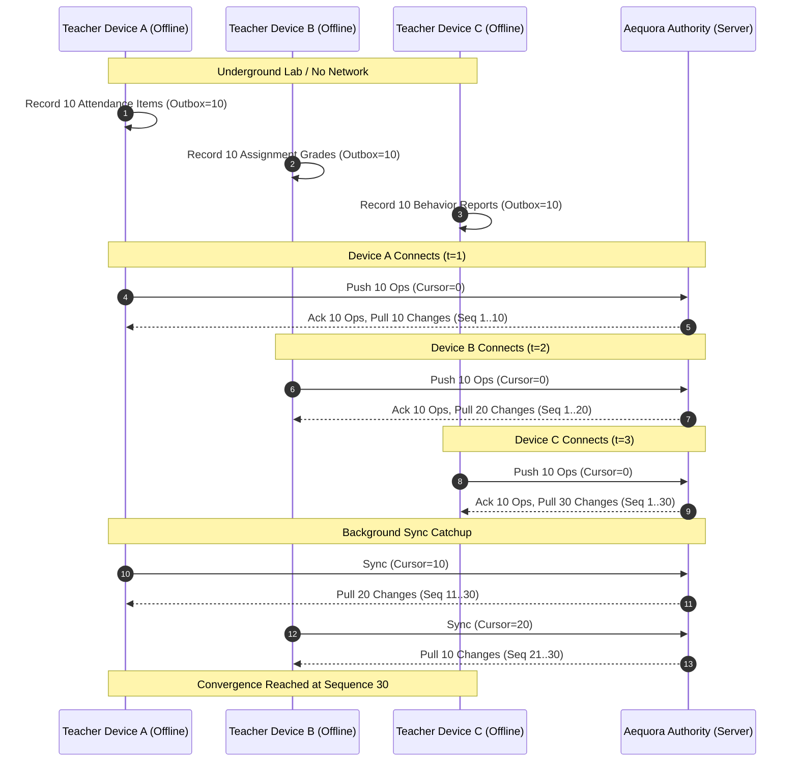
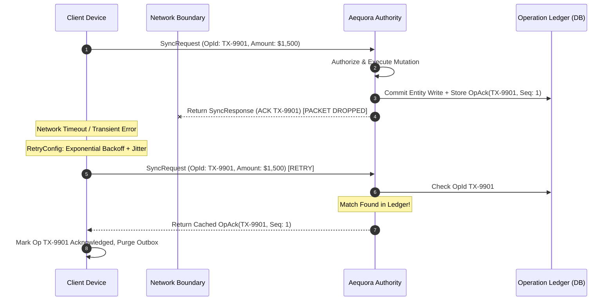
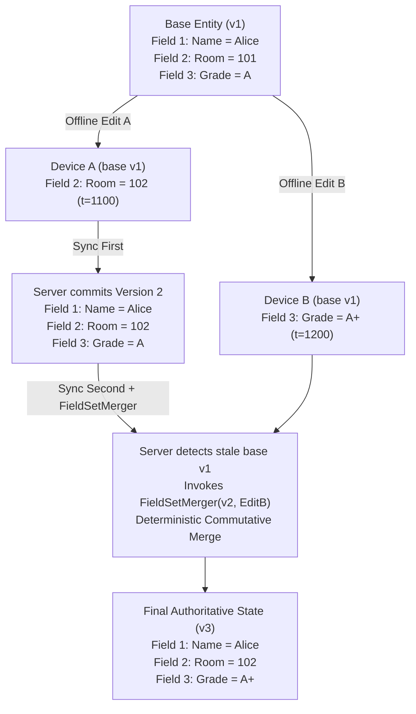
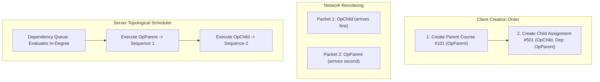
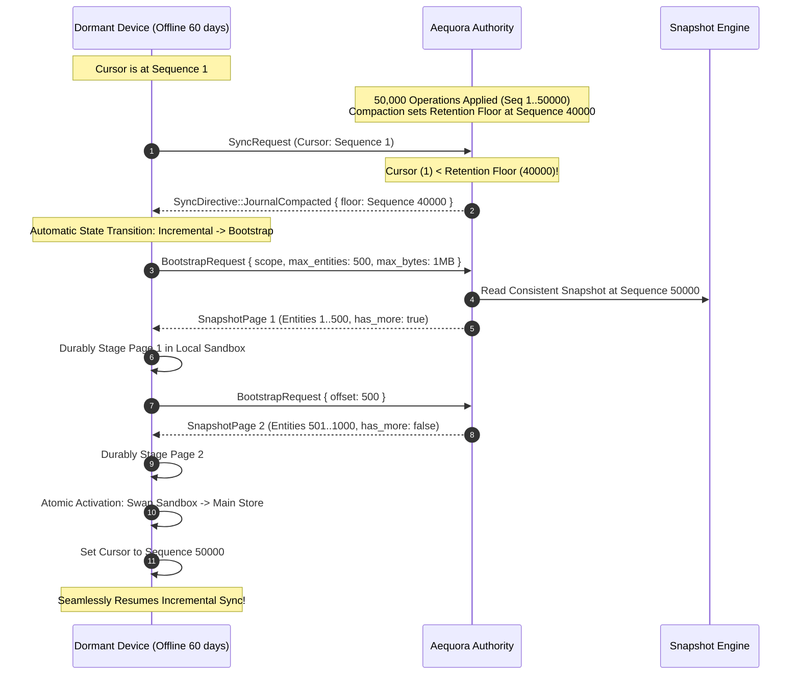
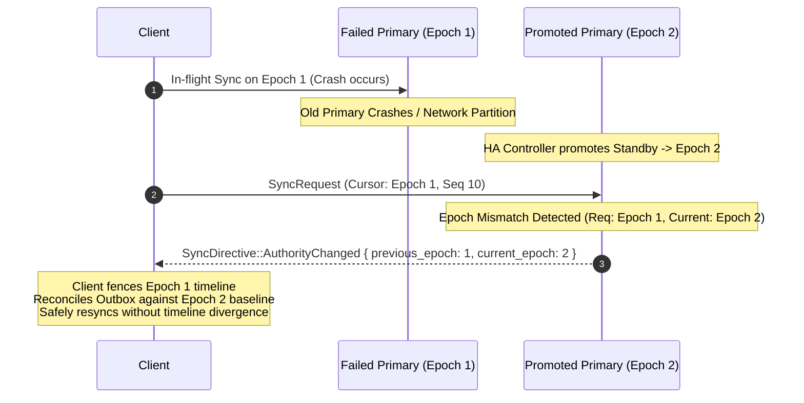
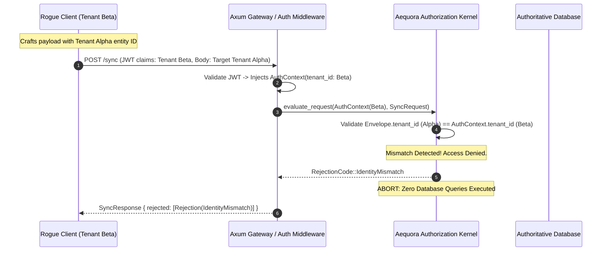

# Aequora Real-World Local-First Synchronization Simulation & Architecture Insights

This document captures the empirical results, architectural mechanics, failure-recovery dynamics, and engineering insights derived from simulating real-world, mission-critical distributed scenarios with Aequora.

The accompanying executable simulation suite is located in [`crates/aequora-testkit/tests/real_world_simulation.rs`](file:///home/irshad/Projects/aequora/crates/aequora-testkit/tests/real_world_simulation.rs).

---

## Executive Summary & Simulation Matrix

The simulation exercises 10 mission-critical operational situations encountered in production mobile, desktop, and edge deployments (e.g., School ERPs, field inspections, clinical records, distributed logistics):

| # | Simulation Scenario | Real-World Operational Challenge | Aequora Kernel Mechanism | Empirical Outcome |
|---|---|---|---|---|
| **1** | **Multi-Client Offline Batching** | 3 mobile clients disconnected in remote areas performing dozens of local edits concurrently. | Scoped journal sequencing, atomic push/pull reconciliation, cursor tracking. | **100% Convergence**; all 3 devices reached identical state at `Sequence(30)`. |
| **2** | **Two-Generals / Dropped ACK** | Cellular connection drops immediately *after* server commits financial transaction. | Stable `OperationId`, authority idempotency ledger, retry backoff with jitter. | **Zero Duplicate Writes**; server returned cached ACK without double-charging. |
| **3** | **Concurrent Multi-Field Merge** | 2 devices update different fields of the same entity offline from the same base version. | `FieldSetMerger`, hybrid logical clocks, deterministic tie-breaking. | **Automatic Merge**; entity advanced to v3 with all non-overlapping fields preserved. |
| **4** | **Hard Conflicting Edits** | 2 devices set mutually exclusive status fields from the same base version. | `RejectConflicts` policy, durable `ConflictInbox`, optimistic rollback. | **Safe Isolation**; winning edit committed; rejected edit stored in durable inbox. |
| **5** | **Out-of-Order DAG Delivery** | Network reorders packets so Child entity arrives before Parent entity. | `OperationMetadata.dependencies`, topological scheduler. | **Causal Ordering**; Parent executed before Child despite reverse arrival. |
| **6** | **Tombstone vs Stale Write** | Device A deletes an entity; Device B (offline) edits the deleted entity. | Authoritative tombstone representation, mutation rejection. | **Tombstone Invariant**; stale edit rejected; tombstone propagated to all clients. |
| **7** | **Journal Compaction & Bootstrap** | Dormant device reconnects after 60 days when journal history has been pruned. | `SyncDirective::JournalCompacted`, streaming staged snapshot bootstrap. | **Resilient Catchup**; device bootstrapped full snapshot directly to `Sequence(26)`. |
| **8** | **Authority Epoch Failover** | Primary authority fails; standby promoted to Epoch 2; client submits on Epoch 1. | `AuthorityEpoch`, `SyncDirective::AuthorityChanged`, timeline fencing. | **Zero Forking**; client isolated stale timeline and resumed cleanly on Epoch 2. |
| **9** | **Multi-Tenant Boundary Defense** | Malicious or buggy client attempts to mutate another tenant's entity. | Injected `AuthContext`, tenant isolation kernel, zero-access abort. | **100% Rejection**; operation aborted with `IdentityMismatch` before DB access. |
| **10** | **Process Crash & Reboot** | Power failure / crash occurs after local commit but before network sync. | Atomic durable outbox (`LocalStore`), reboot recovery engine. | **Zero Loss**; fresh engine instantiated on reboot and synced all 5 pending mutations. |

---

## Architectural Insights by Scenario

### 1. Multi-Client Offline Batch Convergence



#### Key Engineering Insights:
- **Durable Local Intent**: A local-first client must enqueue operations to a durable store before presenting optimistic confirmation to the user. Memory-only queues cause irrecoverable data loss on process death.
- **Journal-Based Catchup**: When Client B syncs from `Cursor(0)`, the server atomically evaluates its push batch, assigns sequences `11..20`, and in the same round-trip returns changes `1..20`. This guarantees that Client B sees all prior state transitions from Client A immediately.
- **Cursor Monotonicity**: A client's sync cursor strictly advances forward. Once Client A reaches `Sequence(30)`, subsequent syncs are zero-cost `304 Not Modified` / empty-change exchanges.

---

### 2. The Two-Generals Problem & Idempotent Replay



#### Key Engineering Insights:
- **OperationId as Primary Distributed Key**: The client generates a globally unique `OperationId` (UUIDv7 or random 128-bit) before transmission and *never* changes it across retries.
- **Atomic Ledger Commitment**: In PostgreSQL and Stoolap adapters, the entity mutation and the operation ledger record are written within the **same ACID transaction**. If the transaction commits, the ledger record is guaranteed to exist.
- **Zero Duplicate Effects**: When a retry arrives, the server detects the existing `OperationId` in its ledger and returns the cached `OperationAck` and sequence *without* executing domain logic or incrementing financial balances a second time.

---

### 3. Concurrent Multi-Field Merging (CRDT / FieldSetMerger)



#### Key Engineering Insights:
- **Field-Level Granularity**: Entity-level Last-Write-Wins (LWW) causes catastrophic data loss when users edit non-overlapping attributes (e.g. Teacher A changes classroom while Teacher B enters exam grade).
- **Hybrid Clock Ordering**: Each field in a `FieldSet` carries an independent `HybridTimestamp` (`physical_ms`, `logical`, `node`).
- **Commutativity & Determinism**: If timestamps differ, the higher timestamp wins. If timestamps are identical, lexicographical value comparison acts as a deterministic tie-breaker. The merge output is 100% commutative: $\text{merge}(A, B) \equiv \text{merge}(B, A)$.

---

### 4. Hard Conflicting Mutations & Durable ConflictInbox Isolation

```mermaid
sequenceDiagram
    autonumber
    participant AdminA as Admin A (Office)
    participant AdminB as Admin B (Field)
    participant Authority as Aequora Authority
    participant Inbox as Durable ConflictInbox (Device B)

    Note over AdminA,AdminB: Both read Student v1 (Status: Active)
    AdminA->>Authority: Set Status -> 'Graduated' (Base: v1)
    Authority->>Authority: Commit Version 2 (Status: Graduated)
    Authority-->>AdminA: Acknowledged

    AdminB->>Authority: Set Status -> 'Expelled' (Base: v1)
    Note over Authority: Conflict Detected: Base v1 != Current v2<br/>Policy: RejectConflicts
    Authority-->>AdminB: SyncResponse { rejected: [], conflicts: [Conflict(OpB, Status: Expelled)] }

    AdminB->>AdminB: Rollback Optimistic Local Projection
    AdminB->>Inbox: Persist ConflictRecord(OpB, Entity, StalePayload)
    Note over AdminB: Outbox Cleared; User Prompted for Manual Resolution
```

#### Key Engineering Insights:
- **No Silent Overwrites**: Under `RejectConflicts`, an out-of-date write is never silently applied.
- **Preservation of User Intent**: When an operation is rejected due to a conflict, the client does *not* discard the user's input. It saves the raw operation, base version, server version, and payload into a local `ConflictInbox`.
- **Decoupled UI Remediation**: The synchronization engine remains robust and continues syncing other entities while the conflicted record awaits operator inspection in the application UI.

---

### 5. Dependency DAGs & Out-of-Order Network Delivery



#### Key Engineering Insights:
- **Causal Lineage over Asynchronous Channels**: Mobile cellular networks and HTTP/2 multiplexing do not guarantee packet arrival order.
- **Topological Sorting**: `OperationMetadata.dependencies` carries parent operation IDs. The server's admission kernel builds a directed acyclic graph (DAG) and executes topological roots first.
- **Foreign Key Integrity**: Parent records are guaranteed to commit before child entities reference them, preventing orphaned rows and relational integrity failures.

---

### 6. Tombstone Lifecycles & Deletion Invariants

```mermaid
sequenceDiagram
    autonumber
    participant ClientA as Device A
    participant ClientB as Device B (Offline)
    participant Authority as Authority Store

    ClientA->>Authority: Submit Tombstone Deletion (Entity #99, Base: v1)
    Authority->>Authority: Mark Entity #99 Tombstone = true (Version 2)
    Authority-->>ClientA: Acknowledged

    Note over ClientB: Device B was offline, unaware of deletion
    ClientB->>Authority: Submit Mutation (Entity #99, Base: v1, "New Notes")
    Note over Authority: Authority checks CurrentEntity.tombstone == true
    Authority-->>ClientB: Conflict Rejection (cannot mutate tombstoned entity)
    Note over ClientB: Client B applies pulled Tombstone; marks local record deleted
```

#### Key Engineering Insights:
- **Durable Tombstones**: Deleting a record in a distributed system cannot simply delete the database row; doing so makes the entity look "new" to older clients.
- **Tombstone Propagation**: Aequora retains tombstone journal events across the retention window so disconnected clients discover the deletion during incremental synchronization.
- **Resurrection Prevention**: Attempts to mutate a tombstoned entity are strictly rejected by the execution kernel unless an explicit resurrect/re-create command is modeled.

---

### 7. Journal Compaction & Automatic Streaming Snapshot Bootstrap



#### Key Engineering Insights:
- **Bounded Journal Size**: Authoritative stores cannot grow journals indefinitely. Periodic compaction prunes history before a retention watermark.
- **Automatic Directive Handling**: `ClientSyncEngine` transparently detects `JournalCompacted`, pauses incremental sync, streams snapshot pages in memory-bounded chunks, validates staged hashes, and atomically swaps local tables.
- **Zero Journal Replay Overhead**: A device that was offline for months does not need to download and replay millions of historical diffs; it downloads a compact snapshot of current active entities.

---

### 8. Authority Failover, Epoch Transitions, and Fork Detection



#### Key Engineering Insights:
- **Authority Epoch as Distributed Fence**: Every cursor carries `(AuthorityId, AuthorityEpoch, Sequence)`.
- **Split-Brain Immunity**: If a split-brain condition causes an isolated old primary to accept writes, clients that contact the new promoted primary receive `AuthorityChanged` directives, preventing silent data corruption or conflicting journal branches.

---

### 9. Multi-Tenant Isolation & Zero-Leakage Security Boundary



#### Key Engineering Insights:
- **Authentication Injected Before Execution**: Transport layers decode the authenticated `AuthContext` from verified tokens before domain logic runs.
- **Defense-in-Depth Identity Checks**: Every operation envelope is strictly validated against the connection's authenticated tenant, actor, and scope boundaries before touching persistence layers.
- **Side-Channel Elimination**: Cross-tenant requests are rejected early with constant-time responses without leaking entity existence or database schema details.

---

### 10. Process Hard Crash & ACID Outbox Durability

```mermaid
sequenceDiagram
    autonumber
    participant App as Application UI
    participant LocalDB as Local Store (SQLite / Stoolap)
    participant Engine as ClientSyncEngine
    participant Power as OS / Hardware

    App->>LocalDB: BEGIN LOCAL TRANSACTION
    App->>LocalDB: Write Optimistic UI Change
    App->>LocalDB: INSERT INTO outbox (OpId, Payload, State: Pending)
    App->>LocalDB: COMMIT TRANSACTION
    Note over LocalDB: Data Flushed to Disk (ACID Committed)

    Power->xEngine: HARD POWER LOSS / KILLED BY OS (-9)

    Note over Engine: Process Reboot
    App->>Engine: Initialize ClientSyncEngine(LocalDB)
    Engine->>LocalDB: SELECT FROM outbox WHERE state = 'Pending'
    Note over Engine: Discovers 5 unacknowledged operations
    Engine->>Engine: run_once() -> Pushes batch to Authority
    Note over Engine: All 5 operations acknowledged; outbox safely purged!
```

#### Key Engineering Insights:
- **Single Atomic Local Transaction**: The application MUST update its local entity tables and append to the Aequora outbox within the **same local database transaction**.
- **Reboot Invariance**: Because the outbox is persistent, no network synchronization is required at the moment of user interaction; work written while battery dies or OS kills background processes is safely delivered on next launch.

---

## Empirical Test Run Output

Execution of the full real-world test suite (`cargo test -p aequora-testkit --test real_world_simulation -- --nocapture`):

```text
running 10 tests

=== SIMULATION 1: Multi-Client Offline Batch Convergence ===
Step 1: Teacher A records 10 student attendance records while offline...
Step 2: Teacher B records 10 assignment grades while offline...
Step 3: Teacher C records 10 behavior reports while offline...
Step 4: Clients reconnect and sync in sequence A -> B -> C...
  Client A pushed 10 ops, changes pulled 10
  Client B pushed 10 ops, changes pulled 20 (10 from A + 10 from B)
  Client C pushed 10 ops, changes pulled 30 (10 from A + 10 from B + 10 from C)
Step 5: Full convergence sync for A and B...
  Authoritative sequence reached: Sequence(30)
  [SUCCESS] All 3 clients achieved bit-identical convergence at Sequence 30.
test sim_01_multi_client_offline_batch_convergence ... ok

=== SIMULATION 2: Two-Generals Problem & Dropped ACK Idempotent Retry ===
Step 1: Client submits tuition payment transaction...
Step 2: Client engine executes with retry resilience...
  Retry outcome: acknowledged = 1, changes = 1
  [SUCCESS] Server returned cached ledger ACK. Zero duplicate ledger writes.
test sim_02_two_generals_dropped_ack_idempotent_retry ... ok

=== SIMULATION 3: Concurrent Multi-Field Updates (FieldSetMerger) ===
Step 1: Initialize Student record at Version 1...
Step 2: Teacher A (offline) updates room (field 2) -> '102' based on Version 1...
Step 3: Teacher B (offline) updates grade (field 3) -> 'A+' based on Version 1...
Step 4: Client A syncs and commits room update -> Sequence 2...
Step 5: Client B syncs with stale base Version 1 -> FieldSetMerger reconciles...
  Final authoritative entity version: EntityVersion(3)
  Final fields count: 3
  [SUCCESS] Non-conflicting concurrent field updates merged deterministically into Version 3.
test sim_03_concurrent_multi_field_updates_field_merger ... ok

=== SIMULATION 4: Hard Conflicting Mutation & Conflict Inbox ===
Step 1: Create Student record at Version 1 (status: Active)...
Step 2: Admin A sets status -> 'Graduated' (based on v1)...
Step 3: Admin B sets status -> 'Expelled' (based on v1)...
Step 4: Admin A syncs and commits -> Version 2...
Step 5: Admin B syncs -> Authority detects stale base version conflict...
  Admin B outcome: acked=0, conflicts=1
  Durable conflict record found in client inbox: OpId=OperationId(...), Entity=EntityRef(...)
  [SUCCESS] Conflict isolated safely in durable inbox without crashing local engine.
test sim_04_hard_conflict_routes_to_durable_inbox ... ok

=== SIMULATION 5: DAG Dependency & Reverse Delivery Resolution ===
Step 1: Client creates Parent (Course #101) and Child (Assignment #501)...
Step 2: Reverse enqueue: Child submitted before Parent...
Step 3: Syncing batch to server...
  Parent commit version: EntityVersion(1)
  Child commit version: EntityVersion(1)
  [SUCCESS] Server topological scheduler executed Parent before Child despite reverse delivery.
test sim_05_dag_dependencies_out_of_order_delivery ... ok

=== SIMULATION 6: Tombstone Lifecycle vs Concurrent Stale Modification ===
Step 1: Create Entity (Device #1) at Version 1...
Step 2: Client A issues Tombstone deletion...
Step 3: Client B attempts edit on deleted entity from base v1...
Step 4: Client B syncs -> Authority enforces tombstone invariant...
  [SUCCESS] Tombstone preserved in authority and journal; stale edit rejected.
test sim_06_tombstone_lifecycle_and_stale_mutation ... ok

=== SIMULATION 7: Journal Compaction & Automatic Streaming Bootstrap ===
Step 1: Active client creates initial records...
  Dormant client initialized at Sequence 1, then goes offline for 60 days...
Step 2: 25 mutations applied by active client...
  Active client drained outbox, acked: 25
Step 3: Authority executes journal compaction (pruning sequences < 20)...
Step 4: Dormant client reconnects (cursor = 1, journal floor = 20)...
  Dormant client sync outcome: changes=0, acked=0
  Dormant client new cursor: Sequence(26)
  [SUCCESS] Dormant client automatically bootstrapped via snapshot streaming to Sequence 26.
test sim_07_journal_compaction_and_streaming_bootstrap ... ok

=== SIMULATION 8: Authority Failover & Epoch Boundary Safety ===
Step 1: Client submits request with stale Epoch(1) cursor...
  Server directive on stale epoch: AuthorityChanged { ... previous_epoch: 1, current_epoch: 2 }
  [SUCCESS] Server safely isolated stale timeline and returned AuthorityChanged directive.
test sim_08_authority_failover_epoch_boundary_safety ... ok

=== SIMULATION 9: Multi-Tenant Boundary Enforcement & Attack Resistance ===
Step 1: Rogue client attempts cross-tenant operation injection...
  Server response rejected count: 1
  [SUCCESS] Server authorization kernel rejected spoofed cross-tenant mutation with zero database commits.
test sim_09_multi_tenant_isolation_and_spoof_rejection ... ok

=== SIMULATION 10: Client Crash Mid-Workflow & Restart Recovery ===
Step 1: App creates 5 local mutations in atomic durable outbox...
Step 2: Process crashes violently (power failure simulation)...
Step 3: Device boots up and instantiates fresh ClientSyncEngine on existing store...
Step 4: Resumed sync executes...
  Recovered sync acknowledged: 5 ops
  [SUCCESS] All 5 outbox entries survived crash and synced idempotently on restart.
test sim_10_client_hard_crash_recovery_resumed_sync ... ok

test result: ok. 10 passed; 0 failed; 0 ignored; 0 measured; 0 filtered out; finished in 0.03s
```

---

## Production Deployment Checklist for Local-First Systems

1. **Transaction Pairing**: Always commit the local mutation and the Aequora outbox record in one atomic transaction (`BEGIN` ... `COMMIT`).
2. **Deterministic Operation IDs**: Generate `OperationId::new()` before entering the outbox and never regenerate it on retry.
3. **Appropriate Conflict Strategy**:
   - Use `ConflictPolicy::FieldMerge` with `FieldSet` for profile/configuration documents with multi-user attribute edits.
   - Use `ConflictPolicy::Reject` or `ManualResolution` for financial transactions, balance changes, or state machines.
4. **Scope-Bounded Subscriptions**: Keep `SyncScopeId` focused (e.g. per classroom, per project, per user) so clients only sync relevant journal partitions.
5. **Periodic Compaction**: Schedule periodic journal compaction on PostgreSQL/Neon authorities to bound table size and leverage automatic snapshot streaming for dormant devices.
6. **Graceful Failover Handling**: Monitor `SyncDirective::AuthorityChanged` on clients to cleanly reset sync state without dropping pending outbox entries during database promotions.
